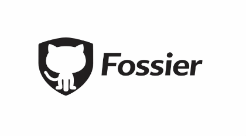

<p align="center">
  
</p>

# Fossier

GitHub spam prevention for open source repositories.

Open source repos face increasing spam PR volume - AI-slop, Hacktoberfest spam, SEO link injection. Trusted and known contributors pass through automatically, and unknown contributors are evaluated through a multi-signal scoring algorithm that estimates spam probability. Legitimate first-time contributors get through and likely spam gets blocked automatically.

**Primary interface:** A GitHub Action that automatically evaluates PRs when opened. Contributors don't need to install or run anything.

**Secondary interface:** A CLI for maintainers to debug evaluations, manage trust lists, and inspect the database.

## How It Works

When a PR is opened, Fossier classifies the author into a trust tier:

| Tier | Source | Outcome |
|------|--------|---------|
| **Blocked** | `VOUCHED.td` denouncements, config `blocked_users` | Auto-close PR |
| **Trusted** | CODEOWNERS, GitHub collaborators, `VOUCHED.td` vouches, config `trusted_users` | Auto-allow |
| **Known** | Previous contributors in the local DB | Auto-allow |
| **Unknown** | None of the above | Run scoring algorithm |

### Scoring Algorithm

Unknown contributors are scored across 13 signals, each normalized to 0.0–1.0:

| Signal | What it measures | Default Weight |
|--------|-----------------|----------------|
| `account_age` | Days since GitHub account creation | 0.11 |
| `public_repos` | Number of public repositories | 0.07 |
| `contribution_history` | Public repos + gists as activity proxy | 0.07 |
| `open_prs_elsewhere` | Open PRs across GitHub (spam signal if high) | 0.11 |
| `prior_interaction` | Has issues/comments on this repo | 0.11 |
| `pr_content` | Files changed analysis (docs-only, code, tests) | 0.11 |
| `follower_ratio` | followers / following ratio | 0.07 |
| `bot_signals` | Username patterns, API `type` field | 0.07 |
| `commit_email` | Public email set, disposable domain detection | 0.05 |
| `pr_description` | PR title/body quality (empty, keyword-stuffed, links, em-dashes, emojis) | 0.05 |
| `repo_stars` | Target repo popularity (high-star repos attract more spam) | 0.05 |
| `org_membership` | Public GitHub organization memberships | 0.05 |
| `commit_verification` | GPG/SSH signed commits | 0.08 |

The composite score (0–100) maps to an outcome:

| Score | Outcome | Default Action |
|-------|---------|----------------|
| >= 70 | **ALLOW** | Record contributor as `known` in DB |
| 40–69 | **REVIEW** | Add label + post score breakdown comment |
| < 40 | **DENY** | Post explanatory comment + close PR |

If too many signals fail (confidence < 0.5), the outcome is forced to **REVIEW** regardless of score.

### Flood Detection

Fossier detects when a non-trusted contributor mass-opens PRs or issues in a short time window — a common pattern with automated spam tools. If an unknown user exceeds the threshold, all their PRs are automatically denied.

```toml
[trust]
flood_threshold = 3      # 3+ PRs/issues from the same unknown user within the window = spam
flood_window_hours = 1   # time window to check (default: 1 hour)
```

Trusted and known contributors are exempt from flood detection. This check runs before scoring, so mass-opened PRs are caught immediately without consuming API quota.

### AI-Authored Commit Rejection

Fossier can automatically reject PRs that contain commits co-authored by AI agents. When `reject_ai_authored` is enabled, commit messages are scanned for `Co-Authored-By` lines matching known AI tools (Claude, Copilot, GPT, Cursor, Codeium, Windsurf, Devin, Gemini, and others). If any match is found, the PR is immediately denied regardless of trust tier or score.

**NOTE:** If you have the global registry access enabled and you reject LLM co-authored commits, it will *not* report the user to the registry as spam. Please do not manually send spam reports __only__ for a user submitting commits which are co-authored by LLM's. The registry is meant to collect incidents of legitimate PR spam and low-effort slop, please use your best judgement when manually submitting spam incidents and keep in mind that not everyone wants to reject any and all AI usage in their repositories.

```toml
[trust]
reject_ai_authored = true  # default: false
```

This check runs before the trust tier cascade and scoring algorithm, so even trusted contributors will have AI-co-authored PRs rejected when this is enabled.

## Quick Start

### GitHub Action (Recommended)

Add to `.github/workflows/fossier.yml`:

```yaml
name: Fossier PR Check
on:
  pull_request_target:
    types: [opened, synchronize]

permissions:
  pull-requests: write
  issues: write

jobs:
  check:
    runs-on: ubuntu-latest
    steps:
      - uses: actions/checkout@v4

      - uses: PThorpe92/fossier@main
        id: fossier
        with:
          contact-url: "https://discord.gg/your-server"
          github-token: ${{ secrets.GITHUB_TOKEN }}
          # Optional: connect to the global spam registry
          # registry-api-key: ${{ secrets.FOSSIER_REGISTRY_API_KEY }}

      - name: Handle result
        if: steps.fossier.outputs.outcome == 'deny'
        run: echo "PR denied with score ${{ steps.fossier.outputs.score }}"
```

> **Note:** Use `pull_request_target` (not `pull_request`) so the action has write permissions and reads config from the base branch — preventing PR authors from modifying their own trust settings.

### CLI

```bash
# Install from a local clone
uv tool install .

# Or install from git
uv tool install git+https://github.com/pthorpe92/fossier.git
```

Once installed, the `fossier` command is available directly:

```bash
# Evaluate a contributor (full pipeline)
fossier check octocat --repo owner/repo --pr 42

# Score only (debug)
fossier score octocat --repo owner/repo --pr 42

# Check trust tier
fossier tier octocat --repo owner/repo

# View decision history
fossier history octocat --repo owner/repo

# Manage trust lists
fossier vouch octocat
fossier denounce spammer --reason "SEO link spam"

# Reject a contributor (denounce locally + report to global registry)
fossier reject spammer --reason "SEO link spam" --pr 42

# Vouch for all existing repo contributors (bootstrap)
fossier vouch-all --repo owner/repo
fossier vouch-all --dry-run  # preview without writing

# Initialize config files and workflows
fossier init

# Bulk-evaluate all open PRs
fossier scan --repo owner/repo

# Scan and take action (close spam, label reviews)
fossier scan --execute

# Database operations
fossier db migrate
fossier db stats --repo owner/repo
fossier db prune
```

### Bulk Scan (workflow_dispatch)

`fossier init` generates a `fossier-scan.yml` workflow you can trigger from the GitHub Actions tab. It evaluates all open PRs at once - closing spam, labeling borderline PRs for review, and passing trusted contributors through. Run with the "dry run" option to preview without taking action.

Locally, the same command works if you have the `gh` CLI authenticated:

```bash
# Preview (no actions taken)
fossier scan --format table --dry-run

# Execute actions (close/label/comment)
fossier scan --execute
```

**Exit codes:** 0 = allow, 1 = deny, 2 = review, 3 = error.

**Global flags:** `--verbose`, `--format json|text|table`, `--dry-run`, `--repo owner/repo`, `--db-path PATH`.

## Configuration

Create `fossier.toml` (or `.github/fossier.toml`) in your repo root:

```toml
[thresholds]
allow_score = 70.0    # Score >= this -> auto-allow
deny_score = 40.0     # Score < this -> auto-deny
min_confidence = 0.5  # Below this -> force REVIEW regardless of score

[trust]
flood_threshold = 3        # PRs/issues from same unknown user in window = flood
flood_window_hours = 1     # time window for flood detection
# reject_ai_authored = false

[registry]
# Global fossier spam registry: share and receive spam intelligence across repositories
# Register at https://fossier.io to get an API key
url = "https://registry.fossier.io"
report_denials = false          # Automatically report score-based denials to the registry
check_before_scoring = false    # Block users with 3+ registry reports before scoring

[weights]
# Signal weights (auto-normalized to sum to 1.0)
account_age = 0.11
public_repos = 0.07
contribution_history = 0.07
open_prs_elsewhere = 0.11
prior_interaction = 0.11
pr_content = 0.11
follower_ratio = 0.07
bot_signals = 0.07
commit_email = 0.05
pr_description = 0.05
repo_stars = 0.05
org_membership = 0.05
commit_verification = 0.08

[actions.deny]
close_pr = true                # Set to false to only comment/label without closing
comment = true
label = "fossier:spam-likely"

[actions.review]
comment = true
label = "fossier:needs-review"

[cache_ttl]
user_profile_hours = 24
search_hours = 1
collaborators_hours = 6

[trust]
trusted_users = ["dependabot", "renovate"]
blocked_users = []
# bot_policy = "score"  # "score" (default), "allow", or "block"
# reject_ai_authored = false  # auto-deny PRs with AI co-authored commits
```

See [`fossier.toml.example`](fossier.toml.example) for the full reference.

Environment variables `GITHUB_TOKEN` (or `GH_TOKEN`) and `GITHUB_REPOSITORY` are read automatically in CI.

### GitHub CLI Integration

If the [GitHub CLI](https://cli.github.com/) (`gh`) is installed and authenticated, fossier will use it automatically:

- **Token fallback** — if no `GITHUB_TOKEN` is set, fossier uses `gh auth token`
- **Search fallback** — when the search API fails (private repos, insufficient scopes), falls back to `gh search prs`/`gh search issues`
- **Collaborators fallback** — uses `gh api` when the REST API can't list collaborators

This means running `fossier check` locally "just works" if you have `gh` set up, no token configuration needed.

## PR Slash Commands

When Fossier labels a PR `fossier:needs-review`, maintainers can interact with Fossier directly from PR comments using slash commands:

| Command | What it does |
|---------|-------------|
| `/fossier approve` | Override the review decision — removes the `fossier:needs-review` label, updates the Fossier comment, and reopens the PR if it was auto-closed |
| `/fossier vouch` | Vouch for the PR author (adds them to `VOUCHED.td`) and approve the PR. Future PRs from this contributor will be trusted automatically |
| `/fossier reject <reason>` | Denounce the PR author, close the PR, and report to the global registry if configured. Reason is required |
| `/fossier check` | Re-run the full evaluation pipeline on the PR |
| `/fossier score` | Post a detailed score breakdown as a reply comment |
| `/fossier vouch-all` | Vouch for all existing repo contributors at once (useful when first adopting Fossier) |

Only repository collaborators with **write** or **admin** access can use these commands. Fossier reacts to the command comment with :eyes: on receipt and :+1: or :-1: on success/failure.

To enable slash commands, add the `issue_comment` trigger to your workflow:

```yaml
on:
  pull_request_target:
    types: [opened, synchronize]
  issue_comment:
    types: [created]

permissions:
  contents: write    # needed for VOUCHED.td commits
  pull-requests: write
  issues: write
```

When `/fossier vouch`, `/fossier reject`, or `/fossier vouch-all` modify `VOUCHED.td`, the change is automatically committed back to the repository with `[skip ci]`.

## VOUCHED.td

A simple trust file you commit to your repo (root or `.github/`):

```
# Core team
+ alice
+ bob

# Known spam accounts
- spammer123  SEO link injection in docs PRs
- slopbot     AI-generated mass PRs
```

Lines starting with `+` vouch for a user. Lines starting with `-` denounce them (with an optional reason). Manage via CLI:

```bash
fossier vouch alice
fossier denounce spammer --reason "SEO link spam"
```

## Database

Fossier uses an embedded [Turso](https://turso.tech/) (SQLite-compatible) database stored as `.fossier.db`. **Commit this file to your repo** — it carries contributor history, prior spam decisions, and the `known` tier cache. In CI, it's also persisted via GitHub Actions cache for faster access between runs.

Tables:
- **contributors**: username, trust tier, latest score, first/last seen
- **score_history**: per-PR score with full signal breakdown (JSON)
- **decisions**: audit log of every allow/review/deny decision
- **api_cache**: cached GitHub API responses with TTL and ETag support

Run `fossier db prune` periodically to clean expired cache entries. Migrations run automatically on first connect, or explicitly with `fossier db migrate`.

## Requirements

- Python 3.13+
- Dependencies: `pyturso`, `httpx`
- Optional: [GitHub CLI](https://cli.github.com/) (`gh`) for enhanced local usage

## Development

```bash
# Clone and install
git clone https://github.com/pthorpe92/fossier.git
cd fossier
make sync

# Run tests
make test

# Install globally
make install

# Lint
make lint
```

Or without make:

```bash
uv sync
uv run pytest -v
uv run fossier --help
```

## License

MIT
